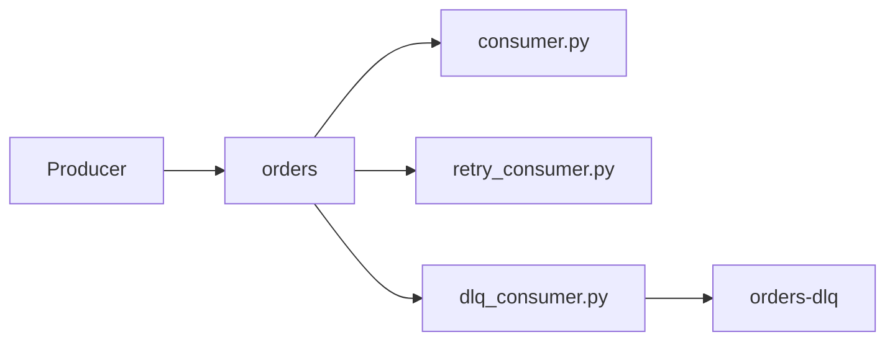

# Avro Serialization 

Kafka-based order pipeline with **Avro** serialization via Confluent Schema Registry. Includes a producer, an aggregation consumer (running average of prices), a consumer with **retry logic** for temporary failures, and a consumer with a **Dead Letter Queue (DLQ)** for permanently failed messages.

Topics used:

- `orders` — main order stream (auto-created on first produce)
- `orders-dlq` — failed messages from the DLQ consumer (auto-created on first DLQ publish)

## Prerequisites

- [Docker Desktop](https://www.docker.com/products/docker-desktop/) (for `docker compose`)
- [uv](https://docs.astral.sh/uv/) (Python environment and dependencies)
- **Python 3.11+** (see `pyproject.toml`)


## Project setup

From the repository root:

```powershell
uv sync
```

This creates `.venv` and installs dependencies (including `confluent-kafka[avro]`) from `uv.lock`.

## Start Kafka stack

Ensure Docker Desktop is running, then:

```powershell
docker compose up -d
```


| Service         | Port | Purpose                                 |
| --------------- | ---- | --------------------------------------- |
| Kafka           | 9092 | Broker at `localhost:9092`              |
| Schema Registry | 8081 | Avro schemas at `http://localhost:8081` |
| Kafka UI        | 8080 | Web UI at `http://localhost:8080`       |


Useful commands:

```powershell
docker compose ps      # check container health
docker compose down    # stop the stack
```

Wait until Kafka is healthy (healthcheck can take ~30 seconds) before starting the producer or consumers.

## Run the application

**Suggested demo:** one terminal for the producer and **one** terminal for a single consumer. Each consumer uses a different consumer group; running several consumers on `orders` at once will each process the same messages unless that is intentional.

### Producer

```powershell
uv run producer.py
```

Publishes Avro-serialized orders to `orders` approximately every 2 seconds.

### Consumers


| Component   | Command                             | Description                                                                    |
| ----------- | ----------------------------------- | ------------------------------------------------------------------------------ |
| Aggregation | `uv run consumer/consumer.py`       | Real-time running average of order prices                                      |
| Retry       | `uv run consumer/retry_consumer.py` | Retries transient failures with backoff; manual offset commit                  |
| DLQ         | `uv run consumer/dlq_consumer.py`   | Retry logic plus forwarding of permanent or exhausted failures to `orders-dlq` |


Stop any running producer or consumer with `Ctrl+C`.

## Architecture




## Project layout

```
avro-serialization/
├── docker-compose.yml    # Zookeeper, Kafka, Schema Registry, Kafka UI
├── producer.py
├── consumer/
│   ├── consumer.py       # aggregation
│   ├── retry_consumer.py
│   └── dlq_consumer.py
├── pyproject.toml
└── uv.lock
```


## Notes

- **Retry / DLQ demos:** `retry_consumer.py` and `dlq_consumer.py` define `SIMULATE_`* flags at the top of the file. Toggle `SIMULATE_FAILURES` and `SIMULATE_PERMANENT_FAILURES` to demonstrate retries and DLQ routing in the console.
- **Inspect messages:** open [Kafka UI](http://localhost:8080) and browse `orders` and `orders-dlq`.

